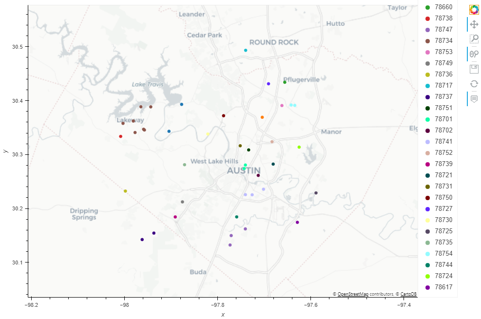
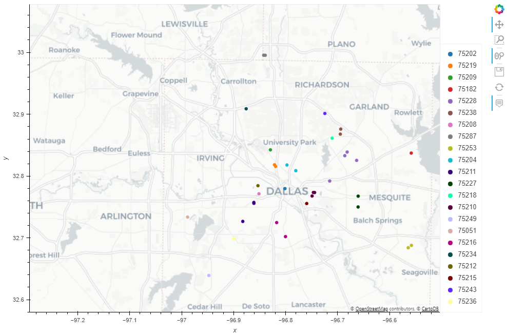
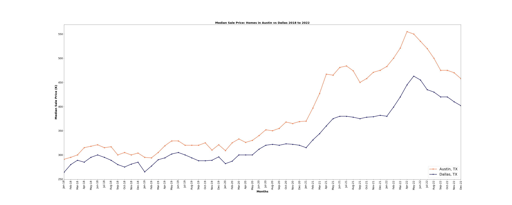
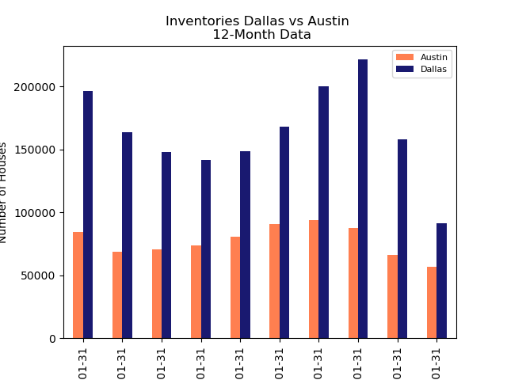
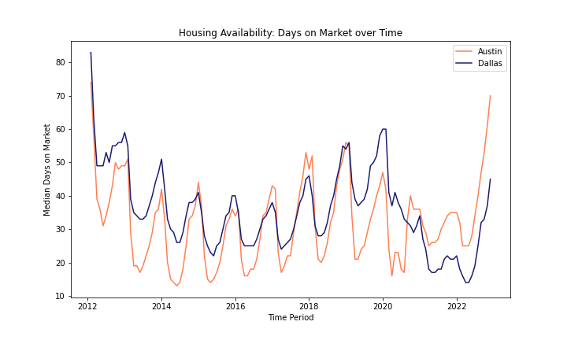
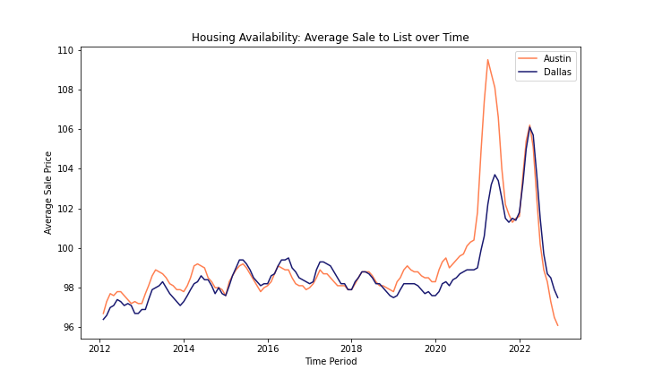
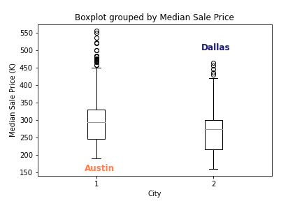
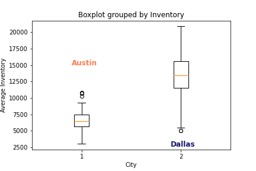
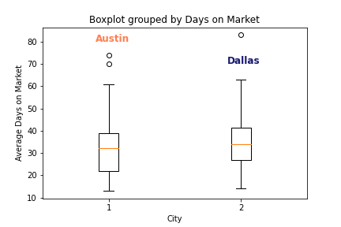

## Group4_project

# Project Title: Compare Housing Market "Hotness": Dallas vs Austin

**Group members:**
*Garret Bradley,*
*Martha Griggs,*
*Bruce Ly,*
*Soujanya Pentyala,*
*Claudia Yurrita,*

### Outline:

A “hot market"(hotness) is a real estate market with low inventory combined with lots of buyers looking for the perfect place.
For this project, our goal is to compare housing inventory (count), price point($) and day on market(count) among the two cities Dallas and Austin & determine which is more desirable based on these three factors. We will support our conclusion using visualization and metrics derived from the analysis.

### Question:

Based on the three factors which of the two cities is "hotter"?

### Factors used for comparison

**House availability**
**Pricing**
**Median Days on Market**

### Datasets to be used:

Time period of data used for analysis :  February 2012 to December 2022

Data provided by RedFin.
Redfin 2023, Redfin website, California USA, accesed 08 February 2023, <https://www.redfin.com/news/data-center/> 

[Link to REDFIN HOMEPAGE](https://www.redfin.com)

[Link to REDFIN DATACENTER](https://www.redfin.com/news/data-center/)

|TASK |RESPONSIBLE|
------|------|
| -[] Get the info                          | MG|
| -[] Make data frame and cleansing         | CY|
| -[] Find possible relations               | CY MG SP|
| -[] Create plot charts for visualization  | CY MG SP|
| -[] Statistical analysis                  | CY MG|
| -[] Written analysis and conclusions      | TBD|
| -[] API development and visualization     | BL|
| -[] General Review                        | GB|
| -[] Upload documents to Github            | MG|
| -[] Read.Me document                      |BL CY GB MG SP|
| -[] Powerpoint presentation               |BL CY GB MG SP| 

## Definitions:

***Days on Market***:
The number of days between the date the home was listed for sale and when the home went off-market/pending sale covering all homes with an off-market date during a given time period where 50% of the off-market homes sat longer on the market and 50% went off the market faster. Excludes homes that stay on the market for more than 1 year. 

***Inventories***:Total number of active listings on the last day of a given time period.

***Median Average Price***:The final home sale price covering all homes with a sale date during a given time period where 50% of the sales were above this price and 50% were below this price.

## Outline of the project

We decided to run tests of three different variables (inventories, sale prices and days on the market) between  two cities (Austin and Dallas) to determine which of the cities was more desirable. 

### The hypothesis we tested were:

* Inventories in Dallas are bigger than Austin's
* Days on Market in Dallas are bigger than Austin's
* Prices in Dallas are lower than Austin's

All of the above should be indicators that one house market has more mobility -and demand- than the other.

## Current Offer on Austin

As of February 13, 2023 Zillow had 350 listings just in Austin county. There are 5 counties included in the Austin metropolitan area.  

        

## Current Offer on Dallas

As of February 13, 2023 just in Dallas county there were 4023 houses on sale. Dallas metropolitan area includes 19 counties.

## PRICES

- Historically the prices in both cities show an ascendent trend
- Austin prices have gone from a median sale price of $190,000 in February 2012 up to  $458,000 as of December 2022. This means an increase of 41% in our timeframe.
- On the other hand Dallas has seen its prices up from $160,000 to $402,000, a 51% increase. 

## INVENTORIES

- The inventories in both cities differ greatly, however the gap has decreased greatly since the pandemic.
- Dallas had the biggest amount of inventories but this trend has changed since the pandemic which has resulted in more variability of this indicator over time. 
- In the period analyzed inventories in Austin and Dallas went from 6,541 and 17,066 houses to 73,76 and 10,137 respectively; this is an increase for Austin of 6% and a decrease for Dallas of 41%.

## DAYS ON THE MARKET

- Historically properties in Austin were listed for longer on market compared to Dallas. 
- Over the years, Dallas properties days on market pattern shifted since the pandemic. 
- Properties in Austin were sold within 20 days of being listed between time period 2021 to mid 2022. 

# HYPOTHESIS TEST

## Question: Is Austin real estate market hotter than Dallas's?

First we calculated the metrics for the variables on both markets. 

|City|Inventory_Mean|Median Sale Price_Mean| Days on Market_Mean|
|---|----|---|---|
|Austin|     6567.335878|              311.877863|            32.106870|
|Dallas|    13396.068702|              273.702290|            35.679389| 

|City|Inventory_Var|  Median Sale Price_Var|  Days on Market_Var|
---|----|---|---|
Austin|   2.375871e+06|           8187.569583|          150.865414|
Dallas|   1.215040e+07|            5284.641456|          148.265649|

Plotting the data we see again that the distribution of the inventories differs greatly. 
In the graphs is more evident that prices and day on the market are also disimilar. 

From looking at the data we can deduce the behavior of the inventories in Austin and Dallas are totally different. However we can not say the same for the others. Running Ttests we saw the prices and days on the market variables also differ between cities. 

These results are presented below:

Calculations for Inventory t-test: t-statistic(-20.5068) , p-value ( 0.0000)
As the p-value is less than our critical value (0.05) the hypothesis is rejected

Calculations for Median Sale Price t-test: t-statistic( 3.7645) , p-value ( 0.0002)
As the p-value is less than our critical value (0.05) the hypothesis is rejected

Calculations for Days on Market t-test: t-statistic(-2.3642) , p-value ( 0.0188)
As the p-value is less than our critical value (0.05) the hypothesis is rejected

These findings imply both markets are different and we can choose between them.

Conclusion:
* Based on our data we were able to confirm that Dallas does have more inventories than Austin. 
* The homes in Dallas were on the market longer up until the pandemic in 2019, after the pandemic the market had a major shift and home were not lasting very long on the market.
* The buyer spending pattern over listed price is close across both cities until 2019. During the pandemic, around 2021 is when real estate in Austin saw a huge shift of customers willing to pay a premium over listed price. This trend lasted for about an year and the customer pattern of paying over listed price is declining.

Limitations to note: 
* Dallas is geographically larger compared to Austin. Dallas metro is made up of 19 counties however Austin has only 5

* COVID 19/Pandemic- Market trends began to change and the housing market is still changing

* Population Influxes- How many people were moving to and from each of these areas

* New Construction- How many residential new builds were added

* Average Income

###### Note: Based on articles published by fed reserve and government aids, US households accumulated more savings in 2020 and through the summer of 2021, given that without the spending components such as travel, leisure etc was shut down, indirectly driving buyers to compete against the market competition to secure a place they can call their own. These buyers could have contributed to the outliers in the dataset.

